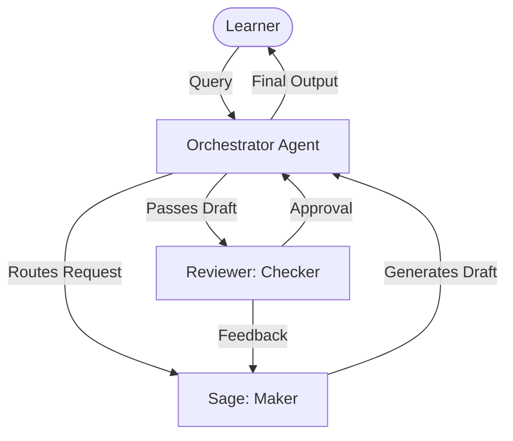

# Architecture

## System Overview

Sage operates within the QUMA AI platform using an OpenGAP-compliant multi-agent architecture. The system separates the concern of generation (Maker) from verification (Checker) to ensure high-fidelity STEM explanations.

## Multi-Agent Communication Flow

1. **Intake**: The Orchestrator receives the user prompt and determines the domain and audience level.
2. **Generation**: Sage receives the parsed prompt and generates a structured explanation using its `concept-breakdown` skill.
3. **Verification**: The generated draft is sent to the Reviewer sub-agent. The Reviewer uses internal logic and potentially external computational tools to verify the math, physics, or logical steps.
4. **Iteration**: If errors are found, the Reviewer sends a structured rejection payload back to Sage, triggering a rewrite.
5. **Delivery**: Once approved, the Orchestrator formats the final response and delivers it to the user.

## Maker-Checker Workflow

This fundamental pattern ensures that Sage never outputs unverified complex derivations. The Maker (Sage) is optimized for pedagogical clarity and empathy, while the Checker (Reviewer) is optimized for pedantic accuracy, strict rule adherence, and logical soundness.

## Tool Invocation Sequences

Sage and Reviewer have access to different toolsets:
- **Sage**: Accesses conceptual databases, memory storage for user preferences, and analogy generation tools.
- **Reviewer**: Accesses mathematical solvers (e.g., Python REPL), unit conversion tools, and fact-checking APIs to validate Sage's work.

## Memory Management Strategy

- **Short-term Context**: The conversational thread retains the immediate context of the current derivation.
- **Long-term Memory**: User preferences (e.g., "Prefers visual analogies", "Undergraduate level", "Speaks Hindi") are stored persistently to tailor future interactions without re-prompting.

## Scalability Considerations

- The stateless nature of the core generation allows multiple Sage instances to handle parallel user requests.
- The Reviewer agent can be scaled independently, as verification often requires more computational resources than generation.
