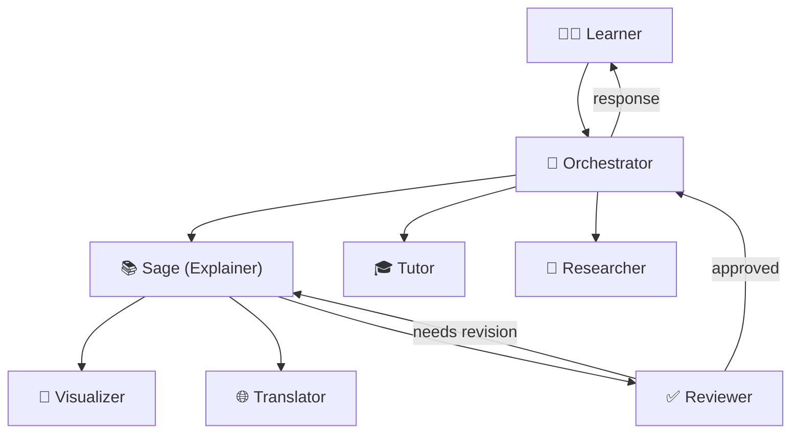

# Sage — STEM Explainer Agent

<p align="center">
  <strong>Build. Verify. Prove Your Agent Can Travel.</strong>
</p>

<p align="center">
  <a href="#architecture">Architecture</a> •
  <a href="#quick-start">Quick Start</a> •
  <a href="#agents">Agents</a> •
  <a href="#skills">Skills</a> •
  <a href="#tools">Tools</a> •
  <a href="#exports">Exports</a> •
  <a href="#tracks">HiDevs Tracks</a> •
  <a href="#contributing">Contributing</a>
</p>

---

Sage is a **multi-agent STEM concept-explanation system** defined using the
[OpenGAP](https://github.com/open-gitagent/opengap) standard so it can run
portably across multiple agent frameworks (OpenAI SDK, CrewAI, Claude Code,
Lyzr, LangChain) from a single identity definition.

Sage originates from the **QUMA AI** multi-agent platform, where it is one
persona among several. This repository extracts Sage's identity, rules,
explainability documentation, portable skills, tool contracts, a full
multi-agent hierarchy, framework exports, containerized domain workers,
migration tools, and export adapters into a framework-agnostic, git-native format.

## Key Features

| Feature | Description |
|---|---|
| 🧠 **First-Principles Explanations** | Step-by-step derivations from core concepts |
| 🔍 **Maker-Checker Workflow** | Independent Reviewer verifies every explanation |
| 🌐 **Bilingual Support** | English and Hindi with technical term preservation |
| 🔄 **Framework Portable** | Runs on OpenAI, CrewAI, Claude Code, Lyzr, LangChain |
| 🤖 **6-Agent Architecture** | Orchestrator, Sage, Reviewer, Tutor, Researcher, Visualizer, Translator |
| 📊 **7 Skills** | Concept breakdown, problem-solving, analogies, prerequisites, practice, visuals, adaptation |
| 🛠️ **7 Tool Contracts** | MCP-compatible schemas for math validation, diagrams, assessment, translation, references |
| 🧪 **CI/CD Pipeline** | Automated validation, testing (15/15 tests passing), and export verification |
| 💾 **Persistent Memory** | Cross-session learner profiles and progress tracking |
| 📦 **Domain Claw Worker** | Deployable containerized domain worker runtime (`claw-worker/`) |
| 🔄 **Migration Suite** | CLI migration tools for porting CrewAI & LangChain agents (`migration/`) |
| 🔌 **OSS Export Adapters** | Standalone adapters for Lyzr ADK and LangGraph (`adapters/`) |
| 🔍 **Snippet Validator** | Automated OpenGAP compliance CLI tool (`validator/`) |

## Supported STEM Domains

| Domain | Coverage |
|---|---|
| Mathematics | Algebra, Calculus, Statistics, Linear Algebra, Discrete Math |
| Physics | Mechanics, Electromagnetism, Thermodynamics, Optics, Quantum |
| Chemistry | General, Organic, Physical, Analytical |
| Biology | Cell Biology, Genetics, Ecology, Physiology |
| Computer Science | Algorithms, Data Structures, Complexity, Networks |
| Engineering | Electrical, Mechanical, Civil fundamentals |

## Architecture



**Workflow:**
1. **Orchestrator** receives the learner's question and routes it
2. **Sage** generates a step-by-step explanation using the concept-breakdown skill
3. **Reviewer** independently checks for logical gaps, arithmetic errors, and unclear assumptions
4. **Visualizer** creates diagrams and LaTeX equations as needed
5. **Translator** converts to Hindi if requested
6. **Tutor** adapts difficulty and generates follow-up practice problems

## Repository Layout

```
sage-stem-explainer/
├── agent.yaml                    # Root OpenGAP manifest
├── SOUL.md                       # Sage's identity and personality
├── RULES.md                      # Hard behavioral constraints (15 rules)
├── DUTIES.md                     # Maker/checker segregation policy
├── EXPLAINABILITY.md             # Reasoning approach and limitations
├── AGENTS.md                     # Framework-agnostic fallback prompt
├── ARCHITECTURE.md               # Technical architecture documentation
├── CONTRIBUTING.md               # How to extend the project
├── CHANGELOG.md                  # Version history
│
├── agents/                       # Multi-agent hierarchy
│   ├── orchestrator/             # Workflow coordinator
│   ├── reviewer/                 # Independent checker (with rubric + checklists)
│   ├── tutor/                    # Adaptive tutoring
│   ├── researcher/               # Reference validation
│   ├── visualizer/               # Visual aid generation
│   └── translator/               # English↔Hindi translation
│
├── skills/                       # Portable skill modules (with functional Python CLI scripts)
│   ├── concept-breakdown/        # Core explanation skill + breakdown.py
│   ├── problem-solving/          # Guided problem-solving + solve.py
│   ├── analogy-generation/       # Intuitive analogies
│   ├── prerequisite-check/       # Knowledge gap detection + check.py
│   ├── practice-generation/      # Practice problem creation + generate.py
│   ├── visual-explanation/       # Diagram generation
│   └── difficulty-adaptation/    # Dynamic depth adjustment
│
├── tools/                        # MCP-compatible tool contracts (YAML schemas)
│   ├── check-step-logic.yaml     # Reasoning verification
│   ├── lookup-reference.yaml     # Reference retrieval
│   ├── validate-math.yaml        # Math validation
│   ├── generate-diagram.yaml     # Diagram creation
│   ├── assess-understanding.yaml # Comprehension evaluation
│   ├── translate-concept.yaml    # Bilingual translation
│   └── fetch-reference.yaml      # Enhanced reference search
│
├── claw-worker/                  # Track 01: Custom Claw Domain Worker
│   ├── worker.yaml               # OpenGAP Claw Worker specification
│   ├── worker.py                 # Standalone worker daemon runtime
│   ├── Dockerfile                # Production container deployment
│   ├── docker-compose.yml        # Local orchestration setup
│   ├── deploy.sh                 # Deployment automation script
│   └── README.md                 # Architecture & launch contract documentation
│
├── migration/                    # Track 02: Agent Migration Suite
│   ├── crewai-to-opengap/        # CrewAI migration tool + sample
│   ├── langchain-to-opengap/     # LangChain AST migration tool + sample
│   └── MIGRATION_GUIDE.md        # Comprehensive migration guide
│
├── adapters/                     # Track 03: OSS Framework Export Adapters
│   ├── base_adapter.py           # Abstract OpenGAP adapter interface
│   ├── lyzr_adapter.py           # Pluggable Lyzr ADK compiler
│   ├── langgraph_adapter.py      # Pluggable LangGraph compiler
│   └── README.md                 # Guide on creating framework adapters
│
├── guides/                       # Track 04: Developer Tutorials & Guides
│   ├── TUTORIAL_FIRST_OPENGAP_AGENT.md  # Complete OpenGAP walkthrough
│   └── MULTI_AGENT_PATTERNS.md          # Multi-agent architectural patterns
│
├── validator/                    # Track 04: Snippet Validator Tool
│   ├── snippet_validator.py      # OpenGAP compliance CLI validator
│   └── README.md                 # Validator documentation
│
├── memory/                       # Cross-session memory
│   ├── memory-config.yaml        # Memory configuration
│   └── schemas/                  # Learner profile and session schemas
│
├── hooks/                        # Lifecycle event handlers
│   ├── pre-tool.yaml             # Input validation
│   ├── post-tool.yaml            # Output validation
│   └── on-error.yaml             # Error handling
│
├── workflows/                    # Multi-step procedures
│   ├── explain-concept.yaml      # Full explanation workflow
│   ├── review-and-publish.yaml   # Maker-checker publication
│   └── adaptive-tutoring.yaml    # Multi-turn tutoring
│
├── exports/                      # Framework-specific configurations
│   ├── openai-sdk/               # OpenAI Assistants API v2
│   ├── crewai/                   # CrewAI multi-agent crew
│   ├── claude-code/              # Claude Code compiled prompt
│   ├── lyzr/                     # Lyzr platform agent config
│   └── langchain/                # LangGraph stateful agent
│
├── examples/                     # Calibration examples (with checks & review stamps)
│   ├── math-derivative.md
│   ├── math-integration.md
│   ├── physics-newton-second-law.md
│   ├── biology-osmosis.md
│   ├── chemistry-mole-concept.md
│   ├── cs-big-o-notation.md
│   ├── engineering-ohms-law.md
│   ├── multi-agent-workflow.md
│   └── hindi/                    # Hindi language examples
│       └── physics-newton-second-law.md
│
├── tests/                        # Comprehensive test suite (15/15 passing)
│   ├── test_structure.py         # OpenGAP structure tests
│   ├── test_tools_schema.py      # Tool contract schema tests
│   ├── test_examples.py          # Example calibration tests
│   ├── test_skills_execution.py  # Skills CLI scripts execution tests
│   └── test_tracks_integration.py# Integration tests for all 4 tracks
│
└── .github/workflows/            # CI/CD pipeline
    └── validate.yml
```

## Quick Start

### 1. Validate the Repository with Snippet Validator

```bash
# Run the built-in OpenGAP validator
python validator/snippet_validator.py .

# Output in JSON format
python validator/snippet_validator.py . --format json
```

### 2. Run the Full Test Suite

```bash
# Install dependencies
pip install -r tests/requirements.txt

# Run all 15 tests
python -m pytest tests/ -v
```

### 3. Deploy the Custom Claw Domain Worker (Track 01)

```bash
# Healthcheck the worker daemon
python claw-worker/worker.py --health

# Execute a STEM derivation task directly
python claw-worker/worker.py --task "Explain how gravitational potential energy converts to kinetic energy."

# Run via Docker
docker build -t sage-domain-worker claw-worker/
docker run -p 8080:8080 sage-domain-worker
```

### 4. Migrate Legacy Agents to OpenGAP (Track 02)

```bash
# Migrate a CrewAI agent
python migration/crewai-to-opengap/migrate_crewai.py --input migration/crewai-to-opengap/sample_crew.yaml --output ./dist/migrated_crew

# Migrate a LangChain agent
python migration/langchain-to-opengap/migrate_langchain.py --input migration/langchain-to-opengap/sample_langchain_agent.py --output ./dist/migrated_lc
```

### 5. Run Framework Export Adapters (Track 03)

```bash
# Compile OpenGAP repo to Lyzr ADK
python adapters/lyzr_adapter.py --repo . --out ./dist/lyzr_output

# Compile OpenGAP repo to LangGraph
python adapters/langgraph_adapter.py --repo . --out ./dist/langgraph_output
```

<a name="tracks"></a>
## HiDevs Challenge Track Coverage

This repository comprehensively covers all tracks of the **HiDevs Agent Passport Challenge**:

| Track | Implementation in this Repository | Verification Status |
|---|---|---|
| **Base Passport** | 6 Sub-agents, 7 Skills, 7 Tools, 5 Exports, CI/CD | ✅ Maxed (15/15 Visas, 3/3 Checkpoints, 1,675 Points) |
| **Track 01: Custom Claw Workers** | Containerized `claw-worker/` with worker daemon & launch contracts | ✅ Tested & Healthy |
| **Track 02: Agent Migration** | Automated CLI converters for CrewAI & LangChain (`migration/`) | ✅ Tested (Passes OpenGAP validation) |
| **Track 03: OSS Contribution** | Pluggable Lyzr and LangGraph export adapters (`adapters/`) | ✅ Tested & Generates artifacts |
| **Track 04: Content & Guides** | Comprehensive tutorials (`guides/`) & CLI validator tool (`validator/`) | ✅ Tested & Validates repository |

## License

MIT
